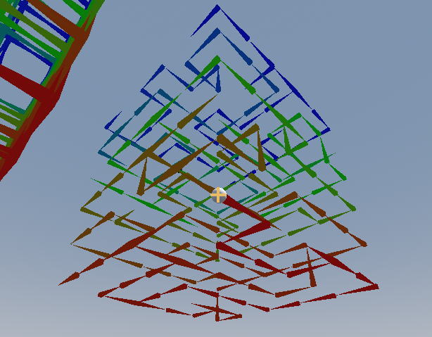
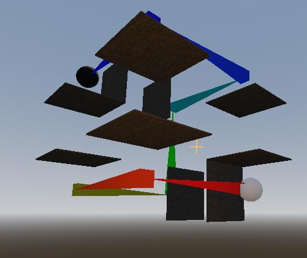
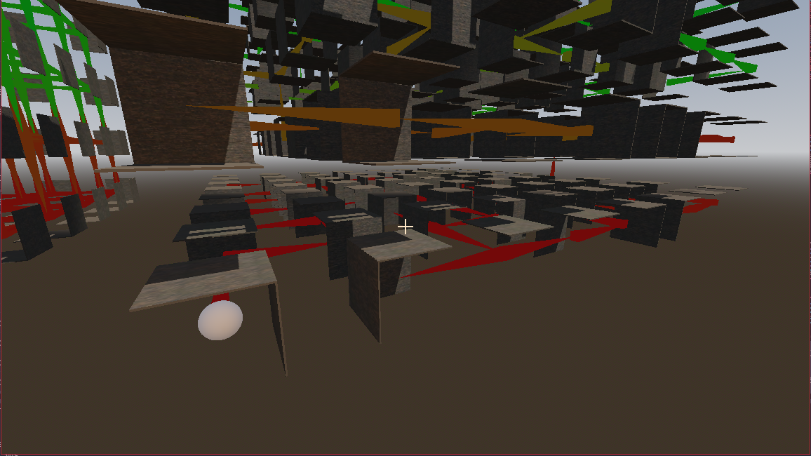
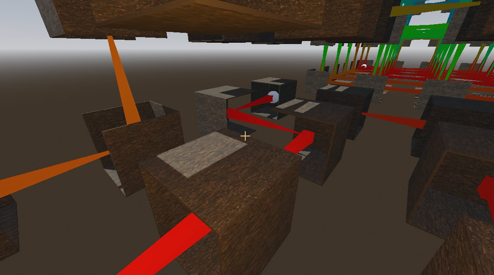

# PP - Projet Perso
## Polyrinthes

### Génération de labyrinthe en 3D

Débug mesh en couleur :

#### Débug, taille de 3
24.04.02

#### Débug, génération en 3D
24.04.13

#### Débug, étage par étage, taille de 10
24.04.23

#### Débug, étage par étage, taille de 6, connection en pyramide
24.07.23

  

#### Débug, étage par étage, taille de 2, connection en pyramide avec murs internes et espacement entre les pièces
24.07.23

  

#### Débug, étage par étage, taille de 8, connection en pyramide avec murs internes et espacement entre les pièces
24.07.23

  

#### Débug, étage par étage, taille de 6, connection en pyramide avec tous les murs et espacement entre les pièces
24.07.23

  

WIP : Différentes sorte de générations

### 3D Maze generator

_english coming as soon as possible_

### Ressources

GODOT version 4.1 (tests sur 4.2 validés)

[wall texture](https://polyhaven.com/)
