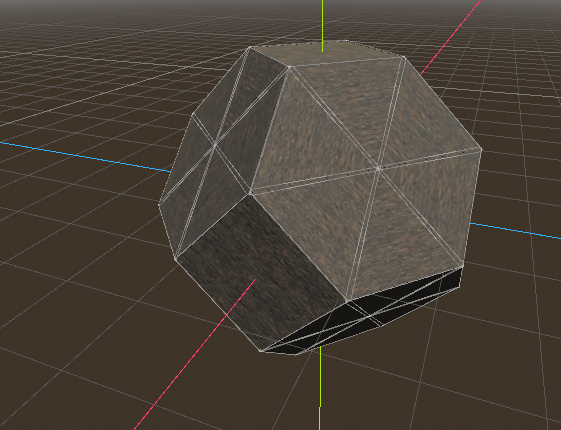
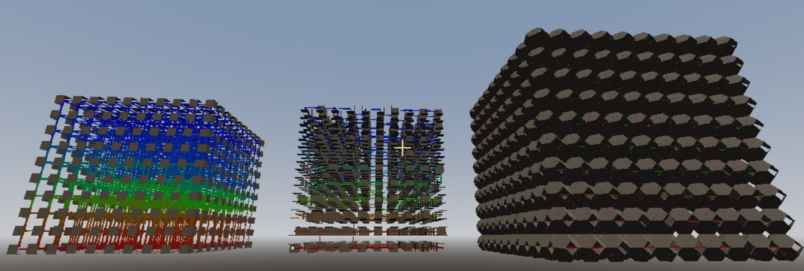

# PP - Projet Perso
## Polyrinthes

### Génération de labyrinthe en 3D
#### Commandes:
maintenir la touche "tab" puis choisir le nombre de salle au déplacement de la souris, relacher "tab" pour lancer une génération avec le nombre de salle correspondant au nombre mis en évidence sur la roue de sélection. 
Débug mesh en couleur :

#### Débug, taille de 3
24.04.02

#### Débug, génération en 3D
24.04.13

#### Débug, étage par étage, taille de 10
24.04.23

#### Débug, étage par étage, taille de 6, connection en pyramide
24.07.23

  

#### Débug, étage par étage, taille de 2, connection en pyramide avec murs internes et espacement entre les pièces
24.07.23

  

#### Débug, étage par étage, taille de 8, connection en pyramide avec murs internes et espacement entre les pièces
24.07.23

  

#### Débug, étage par étage, taille de 6, connection en pyramide avec tous les murs et espacement entre les pièces
24.07.23

  

### Pièces spéciales

#### Octaèdre tronqué
24.07.24

  

#### Generation de labyrinthe avec des octaèdre tronqué et des trous
24.08.07

  

WIP : Différentes sorte de générations

### 3D Maze generator

_english coming as soon as possible_

### Ressources

GODOT version 4.1 (tests sur 4.2 validés)

[wall texture](https://polyhaven.com/)
