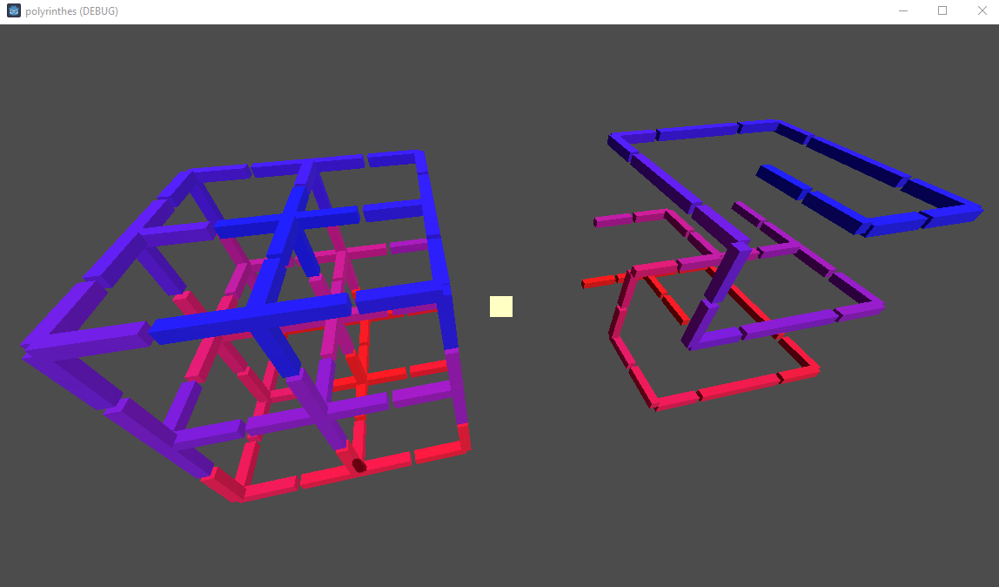
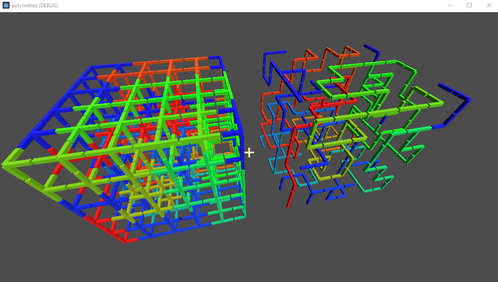

# PP - Projet Perso
## Polyrinthes

### Génération de labyrinthe en 3D

Débug mesh en couleur :

WIP : Différentes sorte de générations

### 3D Maze generator

_english coming soon_

### Ressources

GODOT version 4.1 (testé sur 4.2 aussi)

[wall texture](https://polyhaven.com/)
